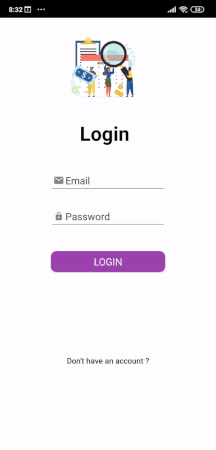
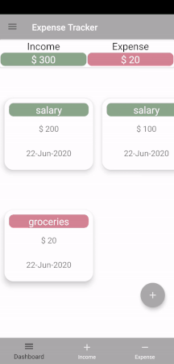

# Expense-Tracker

Expense Tracker allows user to track their incomes and expenses. User can update, delete and keep their data safe with login authentication.  

# Login Activity

Allows users to keep their data private and only visible by them. Using firebase authentication, users can login the app with their registered email and password. Register page allows user to create a new account and start tracking their expenses.

# Dashboard Activities

Users can view their data in dashboard tab, which gives the total expenses and incomes summary to users. Expense tab gives summary of expenses added along with the date that particular entry is made and Income tab gives summary of Income added.

 

 # Add, Delete & Update Activity
 
 This features allow user to add new entry in the income and expense tab, delete the entry and update the information in particular entry
 
 

# Technologies
JAVA, Andriod
